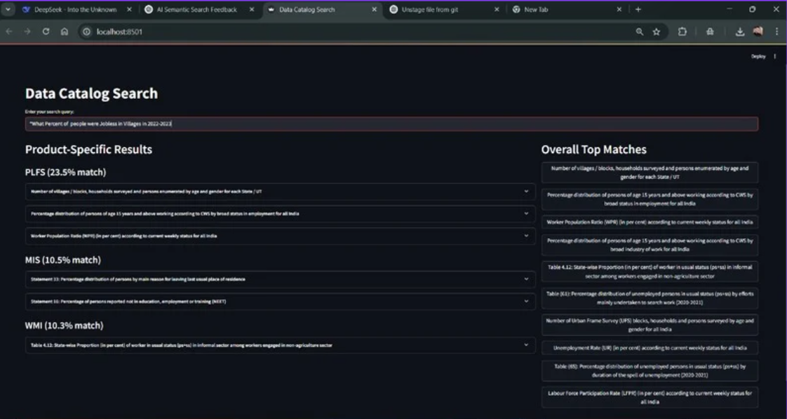

# SmartSearchify-AI-Enabled-Semantic-Search-for-eSankhyiki-Portal

```markdown
# 🔍 Data Catalog Semantic Search App

A powerful Streamlit-based application for semantically searching structured data catalogs using deep learning techniques like Sentence Transformers, CrossEncoders, and classification models.

Look at report.pptx for more details

---

## ✨ Features

- 🔎 **Semantic Query Search**: Understands user intent using sentence embeddings and re-ranks results for accuracy.
- 🎯 **Product Classification**: Predicts the most relevant data product using a Linear SVC classifier.
- ⚡ **Hybrid Search Strategy**: Combines cosine similarity for fast filtering with CrossEncoder for deep semantic re-ranking.
- 📦 **Streamlit UI**: Simple and interactive front-end for non-technical users.
- 📉 **Optimized Performance**: Filters top 50 candidates before deep semantic scoring to save time.

---

## 📁 Project Structure

```
├── final_dataset.csv               # Dataset with precomputed embeddings
├── LinearSVC_classifier.joblib # Pre-trained classification model
├── app.py                      # Main Streamlit application
├── README.md                   # You're reading this :)
```

---

## 🚀 Getting Started

### 1. Clone the repo
```bash
git clone https://github.com/rahulkhichar7/SmartSearchify-AI-Enabled-Semantic-Search-for-eSankhyiki-Portal.git
cd SmartSearchify-AI-Enabled-Semantic-Search-for-eSankhyiki-Portal
```

### 2. Install dependencies
Create a virtual environment (recommended) and install:

```bash
pip install -r requirements.txt
```

Or manually install key packages:
```bash
pip install streamlit pandas numpy sentence-transformers scikit-learn joblib psutil
```


### 4. Run the app
```bash
streamlit run app.py
```

---

## 🧠 Model Details

- **Sentence Embedding Model** : `all-MiniLM-L6-v2` from `sentence-transformers`
- **Semantic Reranker** : `cross-encoder/ms-marco-MiniLM-L-6-v2` from `sentence-transformers`
- **Classifier** : Linear SVC model trained to map queries to one of several data products

---

## 🧪 Memory Profiling

Memory usage is printed in the console:
- Resident memory used (`RSS`)
- Python-level memory tracking (`tracemalloc`)

Example:
```
[After loading models and data] Memory RSS (physical): 1068.53 MB
[After loading models and data] Tracemalloc Current: 38.37 MB; Peak: 43.08 MB
```

---


---

## 🛠 Future Improvements

- Add batch inference for faster processing
- Live memory usage panel in UI
- Add search result export/download

---

## 🧾 License

This project is open-source and free to use under the [MIT License](LICENSE).

---

## 🙌 Credits

Built using:
- [Streamlit](https://streamlit.io/)
- [Sentence Transformers](https://www.sbert.net/)
- [Scikit-learn](https://scikit-learn.org/)
```

---